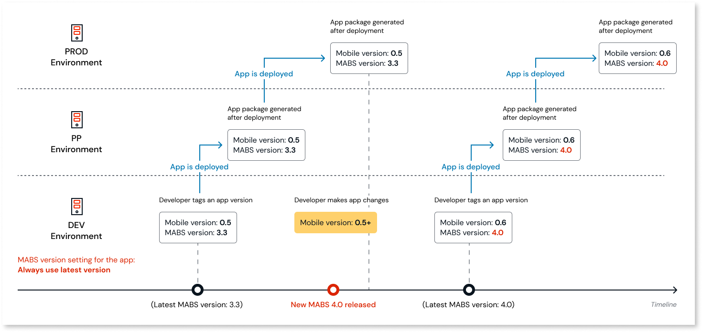
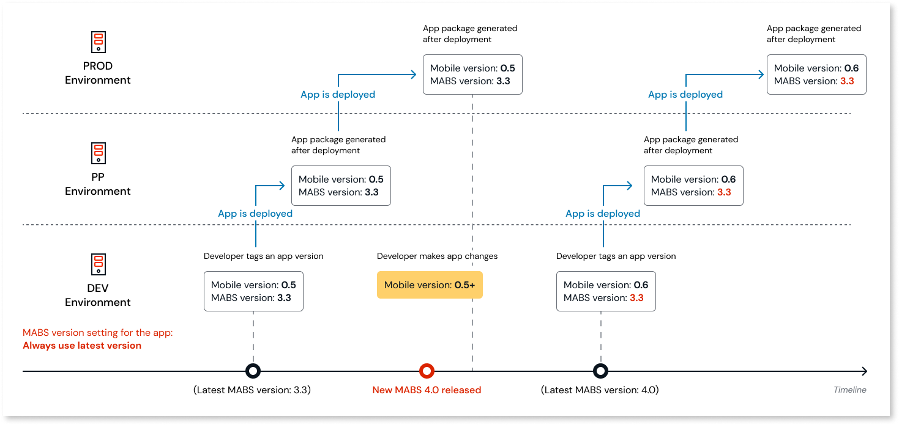

# Mobile Apps Build Service

Applies only to Mobile Apps.

OutSystems allows you to generate mobile application packages for iOS and Android without having to install any mobile platform SDK. To accomplish it, after a request of a new application package OutSystems calls the Mobile Apps Build Service, a **cloud service** developed by OutSystems that generates a new mobile application package.

You **do not** need to install any Platform Server updates to benefit from new versions of MABS, since this is a cloud service provided by OutSystems. 

## Understanding MABS Versions { #understanding-mabs-versions }

OutSystems regularly releases new versions of this cloud service with support for new mobile stacks, and therefore newer mobile platform versions. 

However, this means that support for older mobile operating systems might be dropped in newer versions of the service. You may want to keep supporting older devices, at the cost of not having access to the latest mobile features and eventually being prevented from publishing the app to the mobile app stores, depending on rules dictated by Apple and Google. For this, you will need to specify that you want your mobile app packages for a given mobile app to be built with an older MABS version.

You can check the list of available MABS versions and their corresponding mobile stacks in [Mobile Apps Build Service Versions](<https://success.outsystems.com/Support/Release_Notes/Mobile_Apps_Build_Service_Versions>).

The MABS version selection is done in Service Center for **each application** and for **each mobile platform**. You have two options available:

* **Always use the latest version available**: Always use the most recent MABS version available to generate the mobile package of the app for the current platform and in the current environment.  

* **Specific version _(select from list)_**: Generate mobile app packages (in the current environment) with the MABS version selected from the list.  

The MABS version used to build a mobile package is **saved along with the application version tag**, i.e. when you tag an application version OutSystems saves the MABS version information.

Usually, you perform the MABS version selection in the **Development environment**, and this MABS version will be propagated in every deployment up to Production unless you manually change it in some specific environment using Service Center. 

For example, if you deploy your mobile app from Development to  Pre-Production (PP), change the MABS version in PP and tag a new version of the mobile app in PP, the new MABS version selected in PP will also be used in Production when you deploy the mobile app from PP to Production.

This means that you will be in full control of the MABS version used to generate the mobile app package through the entire mobile app lifecycle, from Development to Production.

When you deploy a mobile app from Development to another environment using LifeTime, the MABS version information saved together with the version tag will be taken into consideration, and the mobile app package will be generated using the **same MABS version** that was used in the source environment.

**MABS version for mobile apps published without using LifeTime**

If you are publishing the mobile app in another environment without using LifeTime, e.g. using an `.oap` file, you will have to **manually configure** the desired MABS version for the mobile in the new environment when publishing it for the first time, since this information is not saved in the `.oap` file, and thus it will not be available in the new environment.

In the following sections, you can find examples of the impact of selecting one option or the other in the Development Environment.

### A) Using the latest MABS version

If a new MABS version is released between two tagged versions in the current environment and you have the "Always use the latest version"  selected, when you tag the second version of the application the mobile app package is generated with the new MABS version and this information is saved along with the version tag.

#### Example 

Consider an infrastructure with 3 environments: DEV, PP and PROD. In the DEV environment we configured the mobile app to always consider the latest MABS version available.

There were two application versions tagged in DEV. Each tagged version was deployed to other environments. Between the two version tag operations, OutSystems released a new version of the MABS cloud service: version 4.0.

 When your mobile app version 0.5 was tagged in DEV, the latest MABS version available was 3.3. The mobile app package was generated using MABS 3.3 and this MABS version information was saved along with the version tag.

 If you deploy the same mobile app tagged version 0.5 through all environments, the mobile app package will be generated using MABS 3.3 even if OutSystems released a new MABS version in the meantime.

When your mobile app version 0.6 was tagged, MABS 4.0 had already been released, and so the **mobile app package was generated using the new MABS version 4.0**. The MABS version information was saved along with the version tag and is propagated through all environments for the same mobile app tagged version 0.6.

### B) Using a specific MABS version

If a new MABS version is released while you are developing a new version of your mobile app and you have selected to use a specific MABS version to build the app, when you tag the new version of the application the mobile app package is generated with the same MABS version that was used in the previous mobile app generation, matching the selected version in the "Specific version" configuration setting.

#### Example

Consider an infrastructure with 3 environments: DEV, PP and PROD. In the DEV environment we configured the mobile app generation to use a specific MABS version: version 3.3.

There were two application versions tagged in DEV, and the application was subsequently deployed to other environments. Between the two version tag operations, OutSystems released a new version of the MABS cloud service.

 When your mobile app version 0.5 was tagged in DEV, the latest MABS version available was 3.3. The mobile app package was generated using MABS version 3.3 version and this MABS version information was saved along with the version tag.

When your mobile app version 0.6 was tagged, MABS 4.0 had already been released, but since the mobile app was configured to use a specific MABS version, **the mobile app package was still generated with MABS version 3.3**. This MABS version was saved along with the version tag information, and the packages generated in other environments also used MABS 3.3 for mobile app package generation.

## Enable the Mobile Apps Build Service for an Environment

The Mobile Apps Build Service operation is optional. You can change its availability in the environment manager, thus allowing or avoiding the generation of new mobile application packages for that environment.

To enable the Mobile Apps Build Service for an environment:

1. Access the Service Center of the environment (`https://<environmentdomain>/ServiceCenter`).
1. Go to **Administration** and click on the **Environment Configuration** tab.
1. Check the **Enable Mobile Apps Build Service** option. 

From now on, every time there is a request for a new mobile application package this service is called.

To disable the service, uncheck the option. In this case, when new developments require a new version of the application package, the current application installed on the devices might not work properly.

## Monitor the Mobile Apps Build Service Status

When Mobile Apps Build Service is enabled for an environment and some problem happens, you can check its operation status in the environment manager to detect the eventuality of the service being down (e.g. in the case when mobile apps are not being generated).

To check the status of the Mobile Apps Build Service:

1. Access the Service Center of the environment (`https://<environmentdomain>/ServiceCenter`).
1. Go to **Monitoring** and click on the  Environment Health  tab.
1. In the **Front-end Servers** table you can see the status of the Mobile Apps Build Service. Click **Details** to see the status of the service for each mobile platform and the log of the applications currently being generated. 
