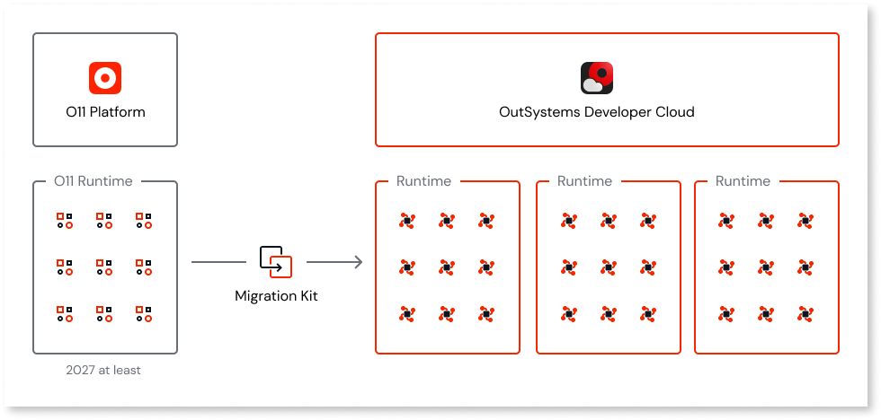
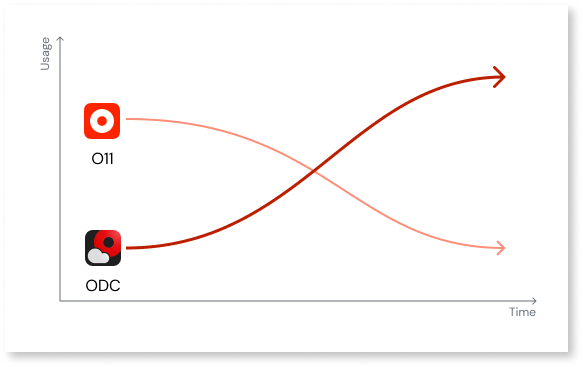
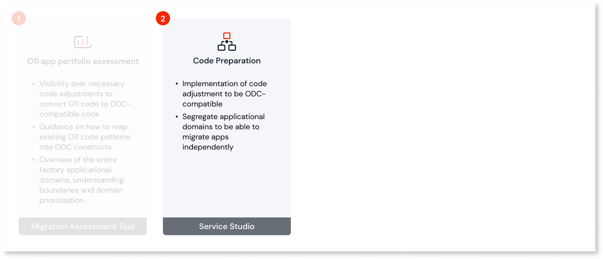
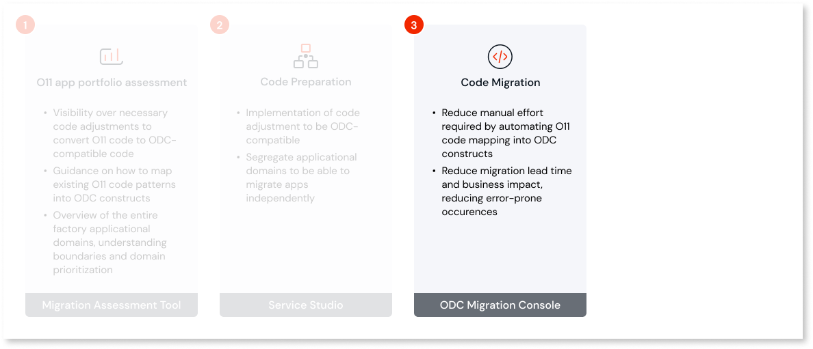

# OutSystems 11 to ODC migration

For over 20 years, OutSystems has been committed to ensuring that you, our customers, have access to the latest and greatest capabilities for software delivery. When we built our product, it was because we wanted to make innovation easier so that you can always be at the forefront of it. It is for this same reason that we released OutSystems Developer Cloud (ODC).

In keeping with this commitment, OutSystems also wants to ensure that you can take your existing O11 app portfolio and modernize it for native ODC apps. This means that even older apps can take advantage of all existing and future ODC capabilities, for example, cloud-native architecture, sc

To make this opportunity for modernization as easy as possible, OutSystems fully supports you in the migration journey by providing documentation and migration tools to ease and automate a significant part of the work.

With that in mind, the following topics will help you understand the migration process.

## How to plan for migration

OutSystems is committed to making sure that you have an easy migration process and one that fits smoothly into your development team's schedule. You can migrate on a timeline that takes into account your app portfolio and business demand.

Depending on the size of your app portfolio, you may follow different migration journeys. 

* **One-shot migration** is suitable for smaller app portfolios (infrastructures with less than 2 business apps) with up to 300 application objects. You can choose to migrate the entire portfolio at once and have it ported to ODC in a short timeframe.

    

* **Coexistence**  is suitable for larger app portfolios (infrastructures with more than 2 apps) where it is essential to continue providing business value and, at the same time, work on the migration activities. With this migration journey, new apps can be created in ODC while you independently migrate apps from O11.

    * **Start using ODC**: ODC tenant for new apps, ability to leverage existing O11 components such as integrations and master data.

    * **Prepare and progressively migrate O11 apps**: Assess and migrate O11 apps that will benefit most from ODC capabilities.

    * **Complete migration of all apps**: Assess and migrate more complex O11 apps.

    

## How migration capabilities will be delivered

Migration capabilities will be delivered incrementally, addressing the most common use cases first, then progressing to more complex ones, and finally aligning with all ODC capabilities. 

## Migration stages

### Stage 1: O11 app portfolio assessment

ODC was designed to bring your apps into the cloud-native future. This means that ODC apps must be architected in a way that allows you to reap the benefits of cloud-native architecture and microservices design, fostering application-independent lifecycle and ownership. In summary, ODC enables businesses to be agile and helps them meet the [DevOps Research and Assessment (DORA) metrics standards](https://dora.dev/).

Once O11 apps are ported over to ODC, for them to truly benefit from all ODC capabilities, it's important to adjust the O11 app portfolio-architecture to align with ODC architecture best practices.  Also, some code patterns are not fully compatible with ODC and must be adjusted accordingly on the O11 side before migration. Also, some code patterns are not fully compatible with ODC and must be adjusted accordingly on the O11 side before migration.

To help with the O11 app portfolio assessment, OutSystems is releasing a [set of documents](../migration-to-odc/preparation/process.md). An automatic assessment tool will also be available to help you automate the O11 app portfolio assessment in a way that can be worked seamlessly into your development activities.

#### Outcomes

* Visibility over necessary code adjustments to convert O11 code to ODC-compatible code

* Guidance on how to map existing O11 code patterns into ODC constructs

* Overview of the entire factory applicational domains, understanding boundaries and domain prioritization

### Stage 2: Code preparation

Once you’ve completed your O11 app portfolio assessment, you must adjust your current O11 app portfolio architecture and code to ensure that migrated apps benefit from all ODC benefits. 

Once the O11 app portfolio assessment (stage 1 of migration) is completed, teams will understand what tasks must be addressed before migrating to ODC and can build these steps into sprints, prioritized according to the desired migration timelines.

#### Outcomes

* Implementation of code adjustment to be ODC-compatible

* Segregate applicational domains to be able to migrate apps independently

### Stage 3: Code migration

Once you’ve completed the O11 app portfolio assessment and the code preparation steps for your app portfolio, it’s time to start converting your O11 apps to ODC apps.

During this step, all O11 apps, modules, and extensions are converted into ODC using the conversion tool. The following are some examples of automations that are in place to guarantee that O11 code is mapped into ODC constructs, keeping the same functionality.

* Replace System references with the ODC equivalent
* Replace Login and Logout flows
* Automatically change the Public property of some elements from **Yes** to **No**, given the [ODC rules](https://success.outsystems.com/documentation/outsystems_developer_cloud/building_apps/app_architecture/reuse_elements_across_apps/)

#### Outcomes

* Reduce manual effort required by automating O11 code mapping into ODC constructs.

* Reduce migration lead time and business impact, reducing error-prone occurrences.

### Stage 4: Data migration

Finally, once the code is converted and published on ODC, it’s time to look at data. Data migration tools will be available to ensure that O11 data is correctly migrated to ODC. These tools help you convert data types, foreign keys, data mapping, and identity mapping.

#### Outcomes

* Reduce testing and business risk by ensuring that O11 data automatically migrated to ODC.

* O11 entities are automatically mapped into ODC counterparts

Once you’ve completed the data migration step, end users can be directed to ODC apps, and O11 apps can be decommissioned.
